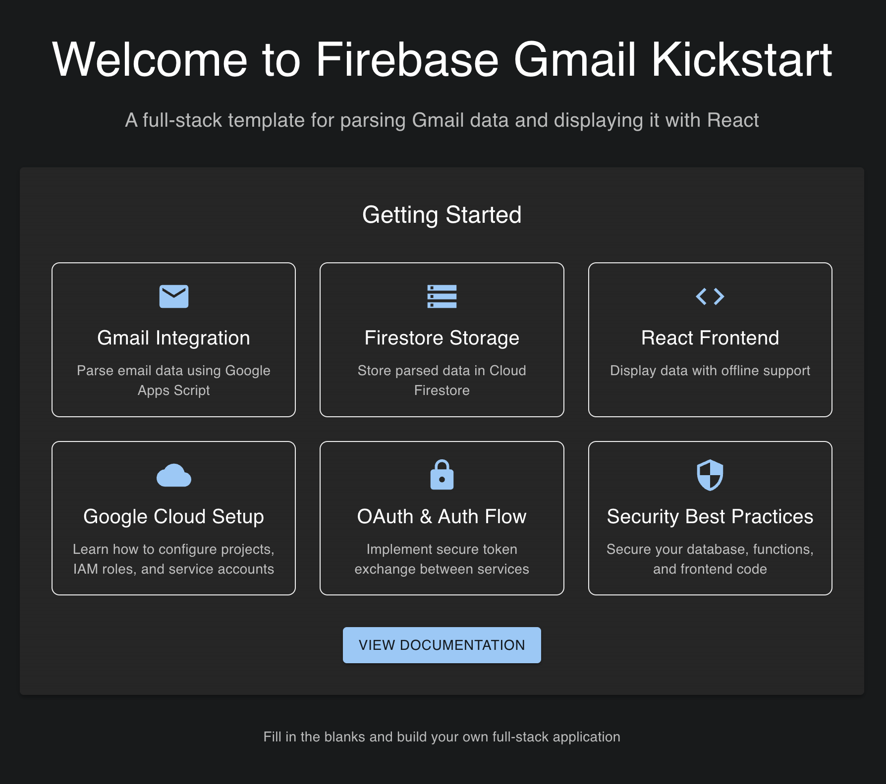
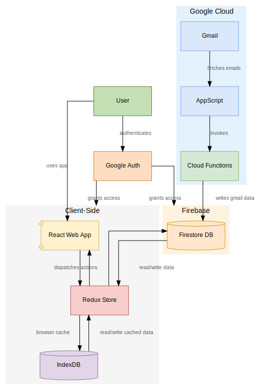

<div align="center">
  <br/>
  
  <br/>
  <br/>
</div>


---

## License

This project is licensed under the [GNU General Public License v3.0](LICENSE).

## Overview

Firebase Gmail Kickstart is a boilerplate project that demonstrates how to build a full-stack application on Google Cloud. The application includes:

- Parsing Gmail messages using Google Apps Script
- Storing parsed data in Firebase Firestore via Cloud Functions
- Displaying data in a React web app with offline support

This template provides empty logic stubs and clear patterns, so you can learn by filling in the blanks and extending each layer.

## Features

* ✉️ Gmail Parsing: Sample Apps Script to fetch and parse email threads.
* ☁️ Cloud Functions: Stubbed functions to process email data and write to Firestore.
* 🗄️ Firestore Integration: Basic Firestore schema and CRUD operations.
* ⚛️ React Frontend: React + TypeScript skeleton to display stored data.
* 🔒 Authentication: Google OAuth stub for user authentication.
* 📦 Offline Caching: IndexedDB setup for offline data storage using `idb`.
* 📈 Delta Sync: Fetch only new records since the last sync timestamp.


## Tech Stack

* Google Cloud: Apps Script, Cloud Functions, Firestore
* Frontend: React, TypeScript
* Offline: IndexedDB (via `idb`)
* Authentication: Google OAuth
* Build: Create React App / CRACO

## Architecture



1. Apps Script triggers on a time-driven schedule to read Gmail.
2. Apps Script sends parsed data to Cloud Functions endpoint.
3. Cloud Function processes and writes to Firestore.
4. React app reads Firestore, caches in IndexedDB, and updates UI.

## Project Structure

```
firebase-gmail-kickstart/
├── appScript/         # Google Apps Script for Gmail parsing
├── functions/         # Firebase Cloud Functions
├── public/            # Static assets and HTML
├── src/               # React web app
└── README.md
```

## Getting Started

1. Set up Firebase project and authentication (see [SETUP.md](SETUP.md))
2. Clone the repo: `git clone <repo-url>`
3. Install dependencies: `npm install`
4. Run the React app: `npm start`
5. Fill in stub logic bu searching for "TODO" comments and learn!
6. Start from appScript, then functions, firestore then React app.
